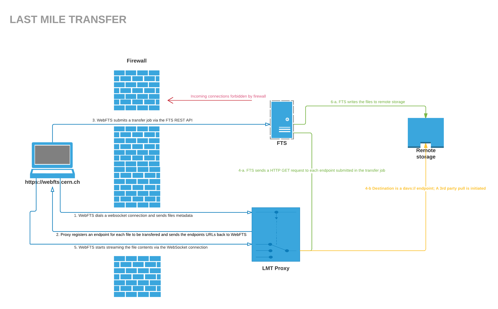

# Architecture
The `LMT` proxy is a proxy service that extends the [File Transfer Service](http://fts3-docs.web.cern.ch/fts3-docs/) in order to enable local data transfers on the [WLCG](http://wlcg-public.web.cern.ch/) infrastructure.

On one end, LMT connects to clients using [WebFTS](http://fts3-service.web.cern.ch/documentation/webfts) via a Websocket connection, on the other, it listens to incoming connections from [FTS](http://fts3-docs.web.cern.ch/fts3-docs/). When FTS is ready to begin the transfer, it start forwarding the data from the client accordingly. 

